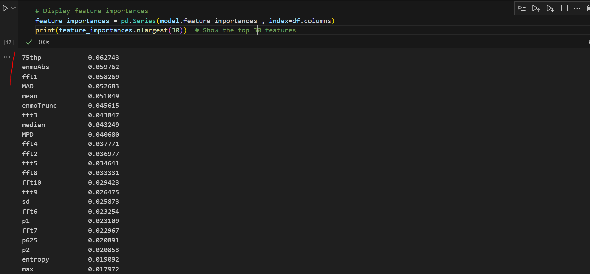

### What was done?
Applied accprocess using gnu parallel in batches of 40 threads (jobs).

### acc process command
command:

--mgCpLPA 45 --mgCpMPA 100 --mgCpVPA 400 --activityClassification True --outputFolder results --verbose True --deleteIntermediateFiles False --csvTimeFormat "yyyy-MM-dd HH:mm:ss.SSSSSS '['VV']'"


  --mgCpLPA 45          LPA threshold for cut point based activity definition
                        (default : 45)
  --mgCpMPA 100          MPA threshold for cut point based activity definition
                        (default : 100)
  --mgCpVPA 400          VPA threshold for cut point based activity definition
                        (default : 400)
  --activityClassification True
                        Use pre-trained random forest to predict activity type
                        (default : True)

  --activityModel ACTIVITYMODEL
                        trained activity model .tar file
  --outputFolder results
                        folder for all of the output files (default : None)
  --verbose True  enable verbose logging? (default : False)
  --deleteIntermediateFiles False
                        True will remove extra "helper" files created by the
                        program (default : True)                        

```
accProcess /accelerometer/accprocess/P001_m.csv --mgCpLPA 45 --mgCpMPA 100 --mgCpVPA 400 --activityClassification True --outputFolder results --verbose True --deleteIntermediateFiles False
```

### Use accelerometer package to process accelerometer csv data
```
accProcess /accel/capture24/participants/P001.csv --csvTimeFormat 'yyyy-MM-dd HH:mm:ss.SSSSSS' --csvTimeXYZTempColsIndex 0,1,2,3 --outputFolder /accelerometer/accprocess/results
```

### Parallel processAcc jobs
Processing takes 82 seconds for one participant which means sequentially it should have taken about ~3.5 hours. Using GNU parallel, we finished it in 17.5 minutes for all 151 participants.


### Get the list of all jobs
TOTAL_JOBS=$(wc -l < /accelerometer/accprocess/all_files.txt)
export TOTAL_JOBS

### Use GNU parallel
```
cat /accelerometer/accprocess/all_files.txt | parallel "accProcess {} --csvTimeFormat 'yyyy-MM-dd HH:mm:ss.SSSSSS' --csvTimeXYZTempColsIndex 0,1,2,3 --outputFolder /accelerometer/accprocess/results > /accelerometer/accprocess/logs/{/}.log; echo Job {#} of $TOTAL_JOBS" > output_log.txt 2> error_log.txt
```

**It is doing in batches of 48.**
- Max number of threads = 48
- Thread(s) per core:  2
- Core(s) per socket:  12
- Socket(s):           2

### piping the errors and outputs to different files
```
TOTAL_JOBS=$(wc -l < /accelerometer/accProcess2-test/all_files.txt)
export TOTAL_JOBS
cat /accelerometer/accProcess2-test/all_files.txt | parallel -j 40 "accProcess {} --csvTimeFormat 'yyyy-MM-dd HH:mm:ss.SSSSSS' --csvTimeXYZTempColsIndex 0,1,2,3 --outputFolder /accelerometer/accProcess2-test/results > /accelerometer/accProcess2-test/logs/{/}.log; echo Job {#} of $TOTAL_JOBS" > output_log.txt 2> error_log.txt
```

### counting the time taken along with piping the output and errors to different files
```
time cat /accelerometer/accProcess2-test/all_files.txt | parallel -j 38 "accProcess {} --csvTimeFor
mat 'yyyy-MM-dd HH:mm:ss.SSSSSS' --csvTimeXYZTempColsIndex 0,1,2,3 --outputFolder /accelerometer/accProcess2-test/results > /accelerometer/accProcess2-test/logs/{/}.log; echo Job {#} of $TOTAL_JOBS" > output_log.txt 2> error_log.txt

    real    11m49.972s
    user    388m29.309s
    sys     41m13.279s
```

### Walmsley predictive power of features
These three are the more important features out of 37: (highlighted in red)



**What are fft features within walmsley?**
1. f75thP
    ```
    v[i] = AccStats.getVectorMagnitude( wx[i], wy[i], wz[i]);
    double[] paQuartiles = AccStats.percentiles(v, new double[] {0, 0.25, 0.5, 0.75, 1});
    ```

    It is the 75th percentile value after combining x,y,z into vector within an epoch.
 
2. fft1
    To get the FFT features, they used Welch's method. In Welch's method, they divide the signal in range (bins). fft1 is the value corresponding to first bin.
 
```
double[] fftVals = sanDiegoFFT(v, sampleRate);
 
inside the function, sanDiegoFFT, they have:
 
        /*         Estimate powers for frequencies 0-9 using Welch's method         
        See: https://en.wikipedia.org/wiki/Welch%27s_method         
        Note: Using the average magnitudes (instead of powers) yielded
                slightly better classification results in random forest
        */         
final int numBins = 10;        
double[] binnedFFT = new double[numBins];         
 
for (int i = 0; i < numBins; i++)
{             
    binnedFFT[i] = 0;
}
``` 