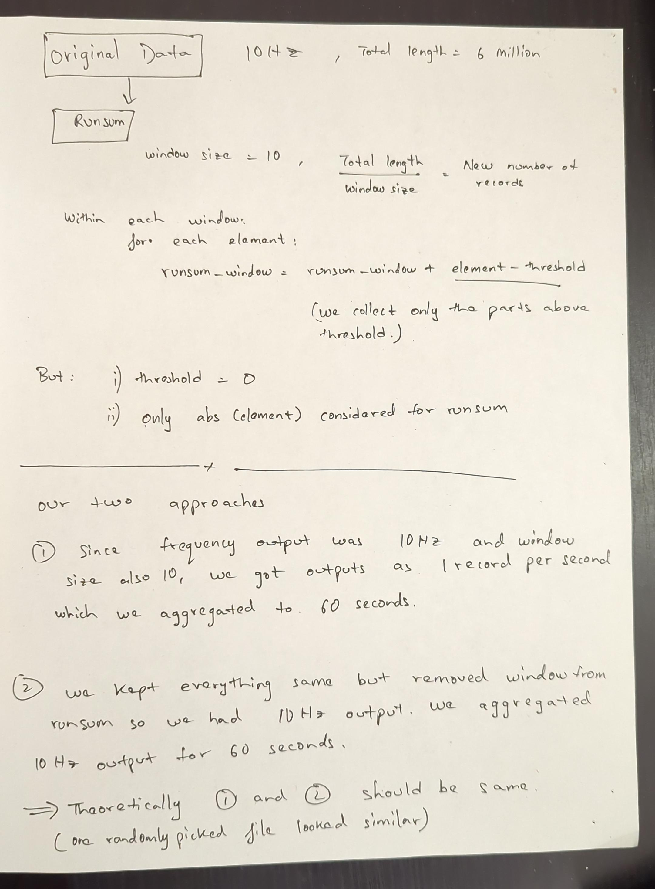

### cwa_csv_processing

1. We converted cwa raw accelerometer data files to csv files using cwa-convert [utility](https://github.com/openmovementproject/openmovement/blob/master/Software/AX3/cwa-convert/c/README.md)

2. Then we calculated acticounts using opensource implementation found [here](https://github.com/jbrond/ActigraphCounts/blob/master/R/Python_G_to_sec.py)

3. We aggregated the counts generated at per second to 60 seconds epochs.
    - input data: 100hz
    - output: 10hz
        Run sum combined the values exceeding the threshold using window size of 10hz
        making the output 1 record per 1 second.
    - more information: 