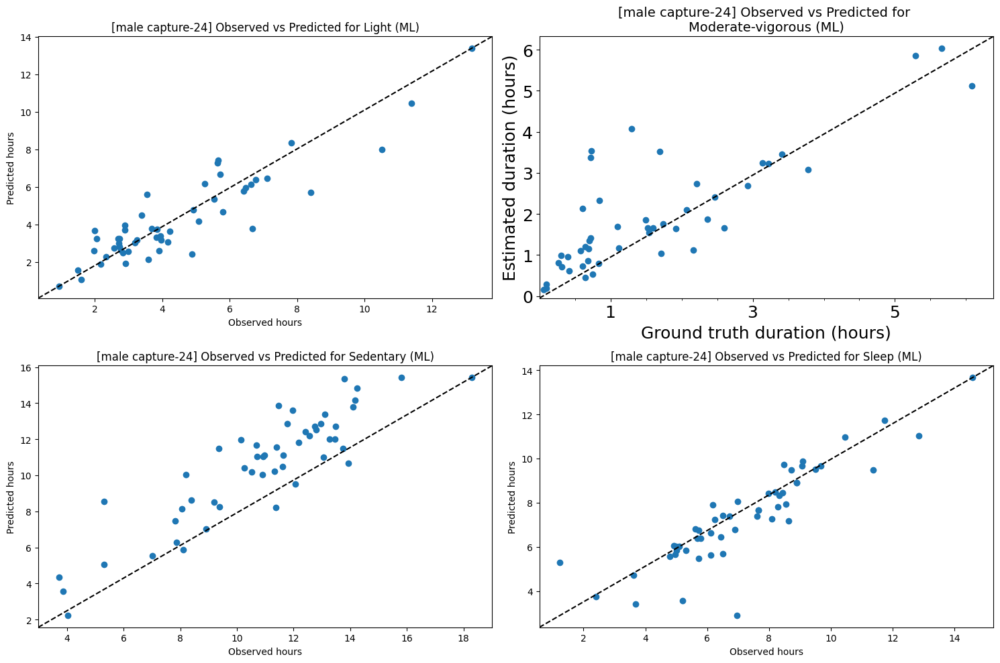
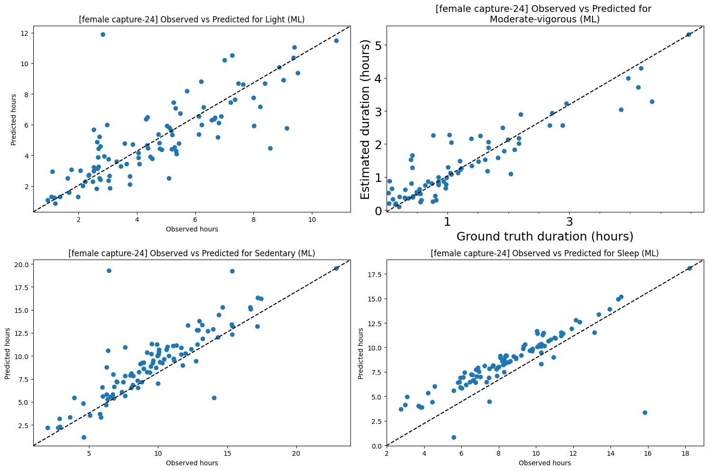

(considering we dropped NaN rows for actual label and walmsley prediction)
 
for female rows where the walmsley prediction matches the actual label:
- Female Accuracy: 0.7591922142631468

plot:

 
 
for male rows where the walmsley prediction matches the actual label:
- Male Accuracy: 0.7086338491702262

plot:

