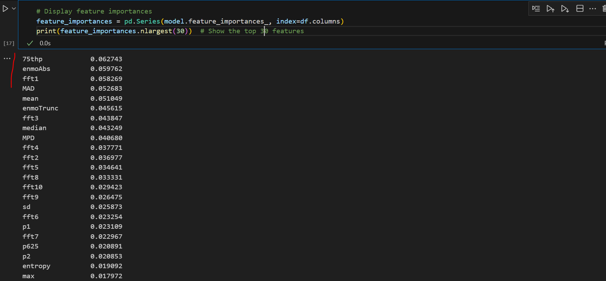
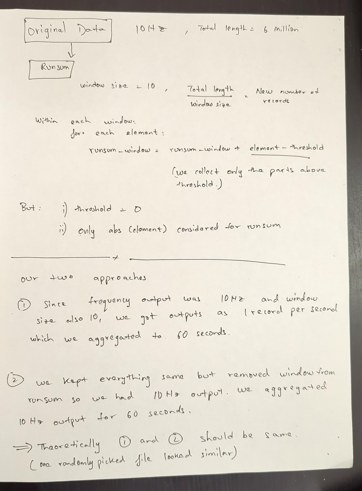

# Epicdsi
This is the repository for work done during summer 2024 at McGill's Department of Epidemiology, Biostatistics and Occupational Health as part of CDSI internship.

### Reflection on the work
How does the whole picture fit? What is the purpose of this work?

**We wanted to compare:**
- PA1 (accProcess model walmsley - ML based)
- PA2 (cutpoint output - ENMO)
- PA3 (acticounts obtained through open source implementation of a commercial blackbox algorithm thresholded on 1 minute epochs)
- True labels

We are interested in MVPA (moderate-vigorous) activities prediction from accelerometer data because that is the most difficult to predict as it needs to be distinguished between light and vigorous activities. This comparison was done over Capture-24 dataset consisting of 151 participants with true labels (more details about capture-24 dataset [here](HAR_wearables/readme.md)). Subsequently, we obtained values for PA1, PA2 and PA3 for 100,000 participants of UKBioBank unlabelled freeliving accelerometer dataset.

The ultimate question which this and subsequent works will contribute towards is how reliable are our current standards for human activities classification from accelerometer data and based on which recommendations for heavy/moderate exercises are given, after studying the relation between observed cases of diseases and the activities those people reported as having done.

What if the standards based on which we collect/ record those activities are not the most appropriate? Meaning the way in which we currently map accelerometer data values to heavy, moderate, light and sedantary activities is not the best? For this, we compared different currently used methods (PA1, PA2, PA3) with true labels.

Further, we wanted to explore what will be the least amount of labelled data needed to get a model which can work in Canadian population even though it was created on a dataset from different population. This is useful because labelled accelerometer data collection and privacy practices considerations make the whole process very expensive and very slow ~ in tune of 10s of thousands of $ (85k) across months (18 months) for only 151 participants. In this internship, to work towards this objective, we calculated PA3 for 100k participants on a compute cluster and studied the latest work on foundation models for the time series data.

### What was done?
- Downloaded, processed and loaded to postgrelsql db - origin destination dataset retrieved from dewey data platform across 5 years (2019-2024) - Upwards of 100GB. Sample and processed data: [here](origin_destination_mobility/sample_data)

- Applied accprocess using gnu parallel in batches of 40 threads (jobs).

- AccProcess generates features from the csv values of the recorded accelerometer data of CAPTURE-24 dataset. That subset of features can be found [here](HAR_wearables/processAcc/features.txt). We 
additionally generated percentile features per direction from accelerometer data hoping it will lead to greater accuracy because it will capture greater movement data separately but there was no significant improvement in accuracy.

- Implemented random forest classifier for 100 participants of CAPTURE-24 dataset [https://ora.ox.ac.uk/objects/uuid:99d7c092-d865-4a19-b096-cc16440cd001] to compare the performance with reported findings from walmsley paper: [https://bjsm.bmj.com/content/56/18/1008#DC1].

- Epochs were classified into activities based on thresholds of cp values.
    cpMVPA: moderate-vigorous
    cpSB:   sedentary
    cpLPA:  light

- We additionally generated percentile features per direction from accelerometer data hoping it will lead to greater accuracy because it will capture greater movement data separately but there was no significant improvement in accuracy.

- Compared the performance of classification for HAR across walmsley prediction and cp values based cut-off thresholds.

- We converted cwa raw accelerometer data files to csv files using cwa-convert [utility](https://github.com/openmovementproject/openmovement/blob/master/Software/AX3/cwa-convert/c/README.md) Then we calculated acticounts using opensource implementation found [here](https://github.com/jbrond/ActigraphCounts/blob/master/R/Python_G_to_sec.py). We aggregated the counts generated at per second to 60 seconds epochs.

- We processed 100,000 participants cwa files in 2 days over Compute Canada cluster using job farm. Suspend and resume functionality was provided with the job submission being handled in batches.

- To obtained final activity proportions, classification based on acticounts thresholds was done.

### How everything is organised?
- [origin_destination_mobility](origin_destination_mobility): Contains scripts for downloading and processing origin destination dataset for 5 years spanning 2019-2024. Also, present are sql commands to load it in a postgresql db.

- [HAR](HAR_wearables): Contains the code and explanations for human activity recognition from accelerometer data. Comparisons with existing SOTA and suggestions for foundation model approaches.
    - [accprocess](HAR_wearables/accprocess): accprocess and walmsley commands 
    - [accprocess_custom](HAR_wearables/accprocess_custom): custom accprocess and accelerometer modded
    - [analysis_notebooks](HAR_wearables/analysis_notebooks): comparison of PA1, PA2 and PA3 outputs, walmsley feature importance, accprocess output compared across genders, plots for PA1, PA2 and PA3 outputs.
    - [cluster_UK_biobank](HAR_wearables/cluster_UK_biobank): cwa_csv_processing and code for 100k participants PA3 processed on a shared cluster under 2 days.
    - [compare classification](HAR_wearables/compare_classification): We wanted to compare the classification performance across different epoch window sizes and different models.
    - [compare_weekly_proportions_UKBioBank](HAR_wearables/compare_weekly_proportions_UKBioBank): We made random selection of 22 participants and calculated proportions of predicted activities across the week using walmsley and our custom model. This was repeated twice using different set of participants.
    - [confusion matrices](HAR_wearables/confusion_matrix)
    - [cp-parallel](HAR_wearables/cp-parallel): Run cp_calculate.py for converting the acceleration values in mg to cp categories based on cut-off points.

### Future work:
Further, we found that there is a foundation model trained for timeseries data [as described in this paper](https://www.nature.com/articles/s41746-024-01062-3). The dataset used was unlabelled UKBioBank free-living dataset for 100,000 people collected across as a time period of one week. We wanted to explore if this pre-trained model could be used for Canadian contexts. This would mean fine-tuning the model on a subset of labelled data collected for Canadian participants. Special care needs to be taken during fine-tuning if there are differences in sensors used for collecting accelerometer data.

- Foundation models for timeseries data: [here](HAR_wearables/accelerometer_self_supervised.md)

### Work at a glance:
#### What are the PAs?
- PA1: ENMO threshold cut-offs for x axis acceleration values
    - 'CpSB', 'CpLPA', 'CpMVPA'

- PA2: random forest classifier based walmsley model (ML) (mainly interested in moderate-vigorous performance because that is the most tricky)

- PA3: reverse engineered acticounts method

#### acticount PA3

#### enmo PA1

#### ml PA2

#### self-supervised training and finetuning for accelerometer data 

#### predictive_features

#### Accprocess and confusion matrix
##### accProcess command
 
##### confusion matrix cp
 
##### confusion matrix walmsley

#### Output frequency for cwa to csv

